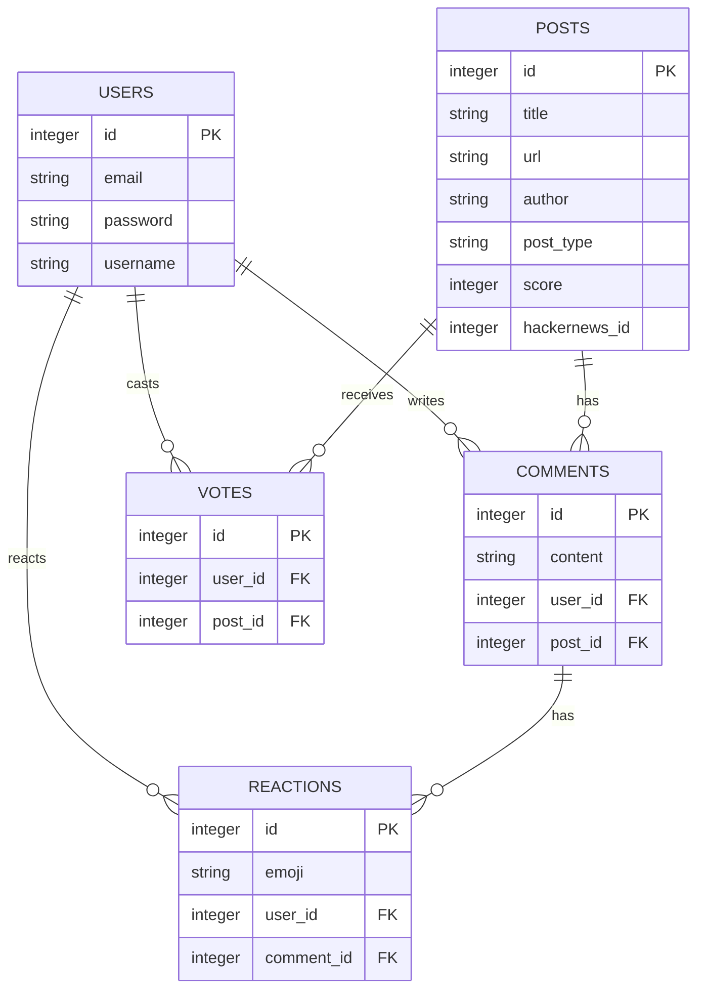

# 📰 Hacker News Rails

A simple Hacker News clone built with Ruby on Rails 7.

Import posts from HackerNews API, vote, comment, and react with emojis.


## ✨ Features

- 🔐 **User Authentication** - Login/signup with username (Devise)
- 📥 **HackerNews API Import** - Fetch posts from HackerNews
- ⬆️ **Voting System** - Upvote posts (toggle functionality)
- 💬 **Comments** - Add comments to posts
- 😀 **Emoji Reactions** - React to comments with emojis
- 📱 **Responsive Design** - Clean Tailwind CSS interface

## 🛠 Tech Stack

- **Ruby on Rails 7.1.5** - Web framework
- **PostgreSQL** - Database
- **Devise** - Authentication
- **Tailwind CSS 2.7** - Styling
- **Heroicons 1.2** - Icons
- **Simple Form** - Forms
- **HackerNews API** - Data source

## 📊 Database Schema



## 🚀 Quick Start

### Prerequisites

- **Ruby 3.3.6+**
- **Rails 7.1+**
- **Node.js 18+** (for Tailwind CSS)
- **PostgreSQL 15+**

### Installation

1. **Clone the repository**

   ```bash
   git clone https://github.com/your-username/hackernews-rails.git
   cd hackernews-rails
   ```

2. **Install dependencies**

   ```bash
   bundle install
   ```

3. **Setup database**

   ```bash
   rails db:create
   rails db:migrate
   rails db:seed
   ```

4. **Start development server**

   ```bash
   ./bin/dev
   ```

5. **Visit the application**
   ```
   http://localhost:3000
   ```

## 🧑‍💻 Development

### Running the application

```bash
# Development server with Tailwind watcher
./bin/dev

# Or manually start separate processes
rails server                    # Rails server
rails tailwindcss:watch        # Tailwind CSS watcher
```

### Key Commands

```bash
# Asset compilation
rails tailwindcss:build        # Compile Tailwind CSS
rails assets:precompile        # Full asset compilation

# Database
rails db:migrate               # Run migrations
rails db:reset                 # Reset database with seeds

# Tests
rails test                     # Run test suite
rails test:system              # Run system tests

# Linting
bundle exec rubocop            # Ruby linting
```

## 📝 API Integration

This project fetches posts from the HackerNews API and allows users to:

- Vote on imported posts
- Add comments to posts
- React with emojis to comments

See [HackerNews API Documentation](https://github.com/HackerNews/API) for details.

## 📄 License

This project is open source and available under the [MIT License](LICENSE).

---

**Built with ❤️ on Rails 7** | [HackerNews Original](https://news.ycombinator.com/)
